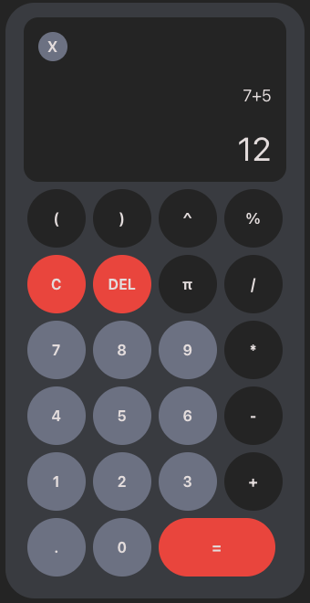
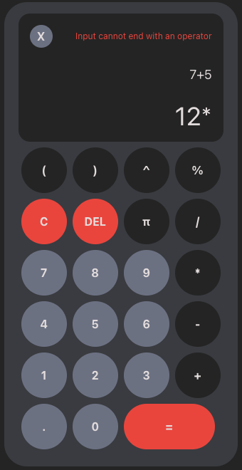
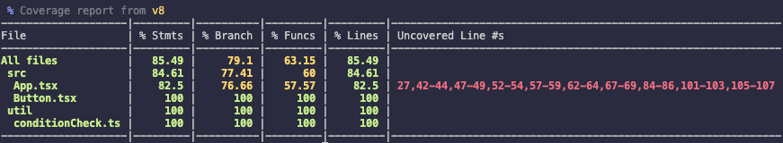

# Calculator
A lightweight calculator with a clean modern structure  

  

## Live Demo
[Try it here]()

## Technologies
- **Build Tool**: Vite  
- **Frontend**: React, Typescript, Tailwind CSS  
- **Testing**: Vitest, Testing Library (react, jest-dom)  

## Features
### Basic math operations

| Operation     | Symbol |
|---------------|--------|
| Addition      | `+`    |
| Subtraction   | `-`    |
| Multiplication| `*`    |
| Division      | `/`    |
| Modulus       | `%`    |
| Exponent      | `^`    |
| Parenthesis   | `()`   |

### Error handling
Handles most invalid expressions  

  

### Keyboard and mouse input
Keyboard keys and mouse clicks will trigger their respective buttons

Typing `1 + 2` on the keyboard updates the display and can be computed with `Enter`

### Testing
Includes Unit and Integration tests for select functions and UI interactions  

## Getting started
1. Clone the repo  
`git clone https://github.com/awprevite/calculator.git`  
`cd calculator`  
2. Install dependencies  
`npm install`  
3. Start the dev server  
`npm run dev`  
4. Open in browser  
Visit `localhost: 5173`  
5. Run tests and view coverage  
`npm run test`  
`npm run coverage` 

